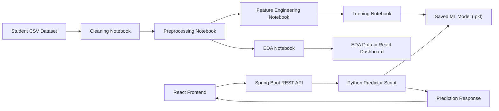

# Student Performance Dashboard with Machine Learning

A full-stack student performance analytics platform that combines real exploratory data analysis, a trained machine-learning model, a React dashboard, and a Java Spring Boot backend. The website helps educators explore the factors linked with exam performance and generate model-backed score predictions from student profile inputs.

## Why This Project Matters

Student performance is shaped by multiple academic, behavioral, and environmental factors. A dashboard like this makes those patterns easier to understand by turning raw student records into usable insights:

- Identifies high-impact signals such as attendance and study hours.
- Shows real EDA visuals instead of static placeholder charts.
- Uses a trained model to produce predictions through the web app.
- Gives educators a practical interface for exploring intervention priorities.
- Demonstrates how data science work can move from notebooks into a deployable product.

## Key Features

- Real dashboard metrics from the local student performance dataset.
- EDA-based analytics views for score distribution, scatter plots, grouped averages, and correlations.
- Spring Boot REST API for prediction and report generation.
- Python bridge that loads the saved `student_performance_model.pkl` model.
- React + Vite frontend with responsive, interactive dashboard screens.
- Deployment-ready configuration for Netlify and Render.

## Tech Stack

| Layer | Tools |
| --- | --- |
| Frontend | React, TypeScript, Vite, Tailwind CSS, Three.js, Lucide React |
| Backend | Java, Spring Boot, Gradle |
| Machine Learning | Python, scikit-learn, pandas, NumPy |
| Data Work | Jupyter notebooks, CSV datasets, EDA visualizations |
| Deployment | Netlify for frontend, Render Docker service for backend |
| Model Artifact | `models/student_performance_model.pkl` |

## Project Structure

```text
.
├── Backend/                         # Spring Boot API and Python model bridge
├── data/                            # Raw, cleaned, preprocessed, and engineered CSV files
├── models/                          # Trained ML model artifact
├── notebooks/                       # Data cleaning, preprocessing, EDA, feature engineering, training
├── student-performance-analytics/   # React frontend application
├── netlify.toml                     # Netlify frontend deployment config
├── render.yaml                      # Render backend deployment config
└── DEPLOYMENT.md                    # Deployment steps
```

## System Design Flow



## Machine Learning Pipeline

1. `DataCleaning.ipynb` prepares the original dataset.
2. `preprocessing.ipynb` encodes categorical variables and prepares numeric data.
3. `FeatureEngineering.ipynb` adds engineered features such as:
   - `Study_Efficiency`
   - `Academic_Engagement`
   - `Lifestyle_Score`
4. `EDA.ipynb` explores feature distributions, correlations, and grouped score patterns.
5. `TrainingModel.ipynb` trains and saves the model as `models/student_performance_model.pkl`.
6. The Spring Boot backend calls `Backend/src/main/python/predict.py`, which loads the saved model and returns predictions to the website.

## Backend API

| Method | Endpoint | Purpose |
| --- | --- | --- |
| `GET` | `/api/health` | Confirms backend service is running |
| `POST` | `/api/predict` | Returns model-backed score prediction |
| `POST` | `/api/insights/report` | Returns an EDA-based report summary |

Example prediction request:

```bash
curl -X POST http://localhost:8080/api/predict \
  -H "Content-Type: application/json" \
  -d '{"studyHours":25,"attendance":98,"previousScore":85,"sleepHours":8,"motivation":"Medium","internetAccess":true,"extracurriculars":false}'
```

## Model Improvement Roadmap

Future improvements for the ML side:

- Save the full preprocessing pipeline with the model using `Pipeline` or `ColumnTransformer`.
- Store scaler and encoder objects instead of recomputing mappings at prediction time.
- Add model versioning with metadata such as training date, feature list, and metrics.
- Compare multiple algorithms using cross-validation and track MAE, RMSE, and R2.
- Add train/test evaluation charts directly into the website.
- Improve feature engineering with interaction terms and domain-informed risk indicators.
- Add input validation based on the real dataset ranges.
- Build a retraining script so new data can refresh the model reproducibly.
- Add explainability with feature importance, permutation importance, or SHAP.
- Monitor prediction drift after deployment.

## Current Dataset Signals

The current EDA surfaced these major relationships with exam score:

- Attendance has the strongest positive correlation.
- Hours studied is also strongly positive.
- Previous scores and tutoring sessions show smaller positive relationships.
- Some lifestyle and environment fields show weaker direct correlations, but may still be useful in interaction with other features.

## Author

Tammana Joshit  
Machine Learning Engineer

- GitHub: [Joshit-innit/Joshit-innit](https://github.com/Joshit-innit/Joshit-innit)
- LinkedIn: [tammana-joshit-97516b344](https://www.linkedin.com/in/tammana-joshit-97516b344)
